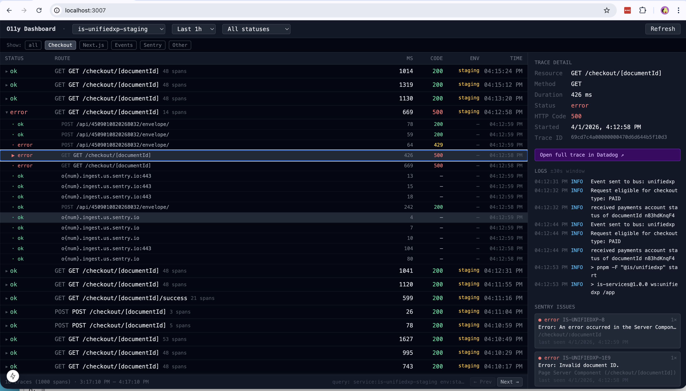

# o11y-dashboard

Internal observability dashboard for Invoice Simple. Aggregates logs and metrics from Datadog and Mezmo (LogDNA).



## Setup

1. Install dependencies:
   ```bash
   npm install
   ```

2. Copy the env example and fill in your credentials:
   ```bash
   cp .env.local.example .env.local
   ```

   - `DD_API_KEY` / `DD_APP_KEY` — from [Datadog API Keys](https://app.datadoghq.com/organization-settings/api-keys)
   - `MEZMO_SERVICE_KEY` — from Mezmo Settings → Organization → API Keys → Service Keys
   - `SENTRY_AUTH_TOKEN` — from Sentry Settings → Account → API → Personal Tokens (requires `alerts:read`, `event:read`, `project:read` scopes)

3. Start the dev server (runs on port 3007):
   ```bash
   npm run dev
   ```

## Stack

- **Next.js 15** (App Router)
- **React 19**
- **Tailwind CSS**
- **TypeScript**

## Data Sources

- **Datadog** — metrics and APM via Datadog API
- **Mezmo** — log export via `https://api.mezmo.com/v1/export`
- **Sentry** — unresolved issues via Sentry REST API (`/api/0/organizations/invoice-simple/issues/`)
